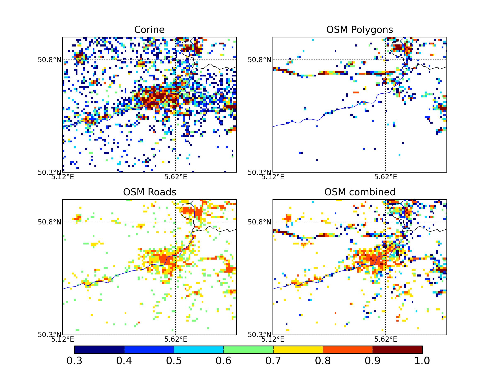

======================================
Welcome to the osm2hydro Documentation
======================================

Introduction
============

This document describes osm2hydro. osm2hydro is a set of (python) tools
that can be used to extract information from OpenStreetMap (OSM) and 
the Shuttle Radar Topography Mission (SRTM) to
kick-start hydrological and hydraulic modelling.

How it works
============

First a region of interest is clipped from an OSM file. 
From this the tools create shapefiles os selected features (OSM tags) and use
those to create 
gridded maps with fraction of paved area, fraction of open water and 
fraction of unpaved area in each cell.  The tools are fully configurable 
and can be used to generate other maps. They are part of the 
Deltares OpenEarth initiative (https://publicwiki.deltares.nl/display/OET/OpenEarth)
and can be downloaded from goodle code at http://osm2hydro.googlecode.com)

Additionally, we created a procedure to use OSM data in the schematisation 
of a hydraulic overland flow model. OSM line elements that represent 
elevated landscape features are burnt onto an elevation map. We use 
the Shuttle Radar Topography Mission 90 meter elevation map 
(http://www2.jpl.nasa.gov/srtm/). Such landscape features are 
essential to include in hydraulic overland flow models as 
they may block floods and reroute water in other directions. 
 

Creating the paved area grids
=============================

The methods we have developed to extract land use maps, is divided in 
the following steps (see also Figure 1):

1. Cut-out a specific region (for the model) from the downloaded OSM file 
   using osmconvert (http://wiki.openstreetmap.org/wiki/Osmconvert), 
   a standard tool which we use unaltered
2. Convert the OSM file to a set of shape files using ogr2ogr (from gdal version 1.10)
3. Convert the shape files to a set of grids (gdal. poly_density, http://www.gdal.org/)
4. Perform corrections on the grids and shapes and string everything together 
   (OSM2hydro, https://publicwiki.deltares.nl/display/OET/OpenEarth)

.. figure:: _figs/Fig-1-schematic.png

Figure 1 Flow chart of the steps taken to derive land use 
(and specifically paved area fraction) maps from OSM

In some areas the different land-use polygons nearly cover the whole area. 
As such, the LU polygons can be used to generate the paved, unpaved and 
water covered area maps we are aiming to derive. However, in large areas 
(also in Western Europe) the coverage is (very) incomplete. For example, 
urban areas in and around Liege are hardly covered (see Figure 2). As such we 
have taken the following approach to come to a best estimate of paved area in larger areas:

Figure 3 Example of the area around Liege with a particularly poor 
OSM coverage.  Paved area determined from Corine (top left), 
paved area as estimated from OSM coverage indicating paved land use (top right), 
paved land use estimated from road density (bottom left) and a 
merger of the two OSM-derived estimates

After the polygons have been extracted from the OSM file the first step is 
to generate high resolution grids from the shape files. The high resolution 
grids by default have a 10 times higher resolution in both the X and Y 
direction. The high resolution grids are then resampled to the final 
resolution, thus allowing the determination of fractional coverage in each cell.
For all road classes an estimated width is configured and this is used 
to generate a (high resolution) grid in which the width is used to 
calculate the fraction covered by roads (assuming the road crossed that 
cell in a straight line). At the same time a road-density map is 
calculated using the same information but in which all roads have a unit width.  
From the density maps and a configurable percentile (default 90%) in the 
road density map a map maximum density () and a threshold value () 
for urban areas is determined. These values are then used in a simple 
equation (for all cells > ) to estimate the paved area within a cell:	

.. math::

    paved = min : 1.0, (den^{cell} + f (den^{Max} - den^{TH}))/den^{Max}

The above equation (where, :math:`f` a scaling factor is 0.75) basically generates 
paved area (houses etc) for all cells that have a road density higher than 
the threshold. This map (of paved area fraction) is then merged with the 
paved area map that is determined from the polygons in OpenStreetMap. 
The merge is done by first applying a multiplication factor to the paved 
area determined from the road density and then taking the maximum of the two 
maps. The multiplication factor (0.8 in this study) represents the 
average paved area fraction in urban areas. 
In a third step the resulting map is merged with the maps that holds 
the fraction of road cover in the cell by adding the two maps together 
while maximising the result to 1.0.

Next two other maps are created, one representing the fraction of 
unpaved land use (from polygons that represent “green” areas) and one 
representing the fraction of open water. The open water fraction maps 
is derived from a combination of waterways in OSM, taking into account 
the river width if it is available, and land use classified as water 
(the combined water maps are maximized at 1.0). 

Generally, the sum of the three maps (paved, unpaved, water) is not 1, 
therefore the maps are adjusted using the assumption that the water 
fraction map and the roads fraction maps are correct using the following steps:

Add the water fraction and paved area fraction maps and subtract the surplus 
(> 1.0) from the paved area map.

If the paved area fraction is not large enough to supply all the surplus 
coverage the surplus is subtracted from the unpaved fraction map

If the resulting total cover is larger than 1 it is assumed that the 
unpaved polygons are correct and the surplus is subtracted from the paved area
any unassigned area in the resulting maps (total coverage < 1.0) is added to the unpaved fraction map
finally, the road fraction map is used to “burn in” road coverage 
over all open water and unpaved area coverage

Combining OSM and SRTM
======================

Usage
=====
.. toctree::
   :maxdepth: 2

   usage

Description of the python modules
=================================

osm2hydro
---------
This is the main script. It needs an .ini file to retrieve it's settings
and execute  programs and scripts.

.. toctree::
   :maxdepth: 2

   osm2hydro

osm2shp
-------
.. automodule:: osm2shp
	:members:
	
map2shape
----------
.. automodule:: map2shape
	:members:
	
gdal_density
------------
.. automodule:: gdal_density
	:members:
	
dem_filter
-----------
.. automodule:: dem_filter
	:members:
	

	
	
Indices and tables
==================

* :ref:`genindex`
* :ref:`modindex`
* :ref:`search`

TODO
====

.. todolist::
